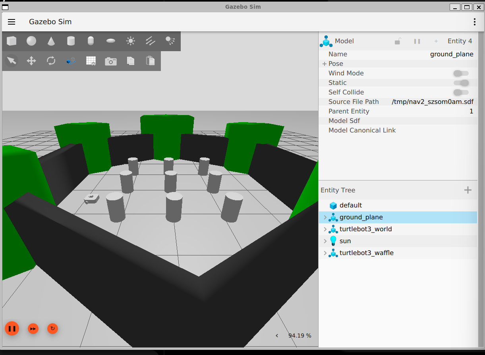
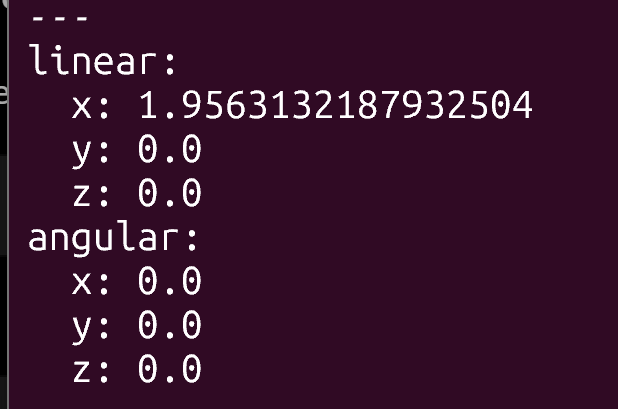
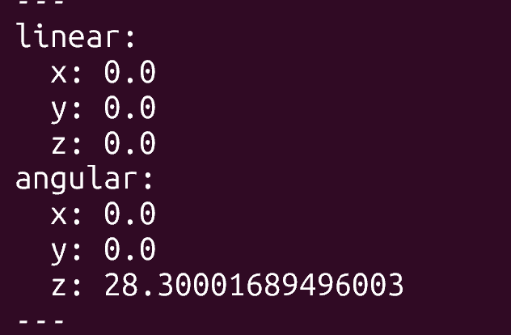
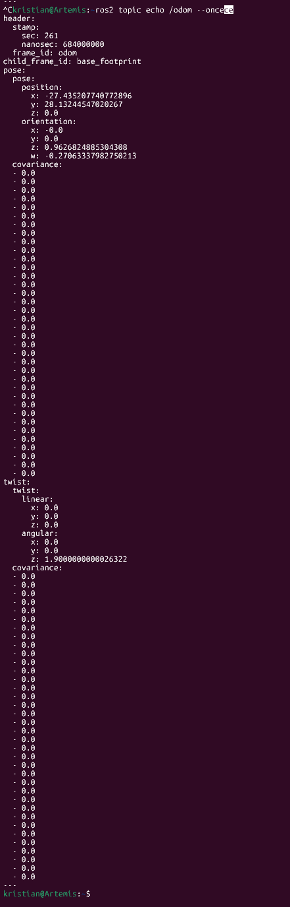
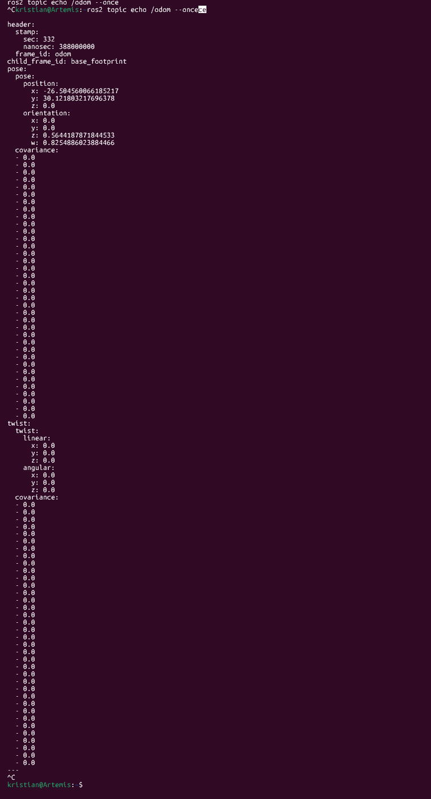

# Lab 2 Answers — TurtleBot Playground

## Driving observations

Describe what you observed during forward, reverse, curved, and in-place motion.
- the robot drove in response to my input on the keyboard at a velocity that i had set. 
## Challenge screenshot

## ROS signal preview

### Forward `/cmd_vel`

### Turning `/cmd_vel`

### `/odom` change
Before moving:

After moving:

Describe one position or orientation field that changed after motion.
After the TurtleBot moved, its position changed. The x-position changed from about -27.44 to -26.50, and the y-position changed from about 28.13 to 30.12. The orientation values also changed, showing that the robot's estimated position and heading were updated in /odom.

## Two-attempt route experiment
| Attempt | Approximate time | Collisions | Stops/corrections | Observation |
|---|---:|---:|---:|---|
| 1 | 45 s | 1 | 6 | I was still getting used to the controls and judging the distance from obstacles. |
| 2 | 34 s | 0 | 3 | The second attempt was smoother because I understood the controls better and used a better camera angle. |

The second attempt was easier because I was more familiar with how the TurtleBot responded to the keyboard controls. I also used a better camera angle, which made it easier to judge turns and distances from obstacles.

## Engineering questions

Answer Questions 1–7 from the README using observations from your own simulation session.

### 1. Which motion was easiest to control, and which was hardest?

Forward motion was the easiest because the TurtleBot
moved in a predictable straight line.

Curved motion was the hardest because the robot was
moving and turning at the same time.

### 2. How did camera placement affect your driving?

Camera placement affected how well I could judge the
robot's position and distance from obstacles.

A higher angled view made it easier to see the robot
and the path ahead.

A view that was too low or too close made turns and
obstacle avoidance harder.

### 3. What happened in `/cmd_vel` during forward motion,
turning, and stopping?

During forward motion, `linear.x` was positive while
`angular.z` stayed at zero.

During an in-place turn, `linear.x` stayed at zero
while `angular.z` became positive or negative.

When the robot stopped, both values returned to zero.

### 4. What changed in `/odom` after the robot moved?

The position and orientation values in `/odom`
changed after the robot moved.

The position values changed when the TurtleBot moved,
and the orientation values changed when it turned.

This showed the robot's updated estimated pose.

### 5. Why is a velocity command alone insufficient to
complete a destination-based mission?

A velocity command only tells the robot how fast to
move or turn at that moment.

It does not tell the robot where the destination is,
where obstacles are located, or whether the goal has
been reached.

The robot also needs sensing, localization, planning,
and control.

### 6. Which human tasks in this exercise will later be
performed by sensing, localization, planning, and
control software?

During the exercise, I had to observe the environment,
estimate where the robot was, choose a path, decide
when to turn or stop, and correct mistakes.

In an autonomous system, sensors observe the
environment, localization estimates position,
planning chooses a route, and control software
generates movement commands.

### 7. Why might the same keyboard commands produce
different motion on physical Goosebot?

The physical Goosebot may behave differently because
real hardware has effects that are simplified in
simulation.

Wheel slip, friction, motor differences, battery
level, uneven surfaces, mechanical tolerances, and
sensor noise can all change the robot's motion.

