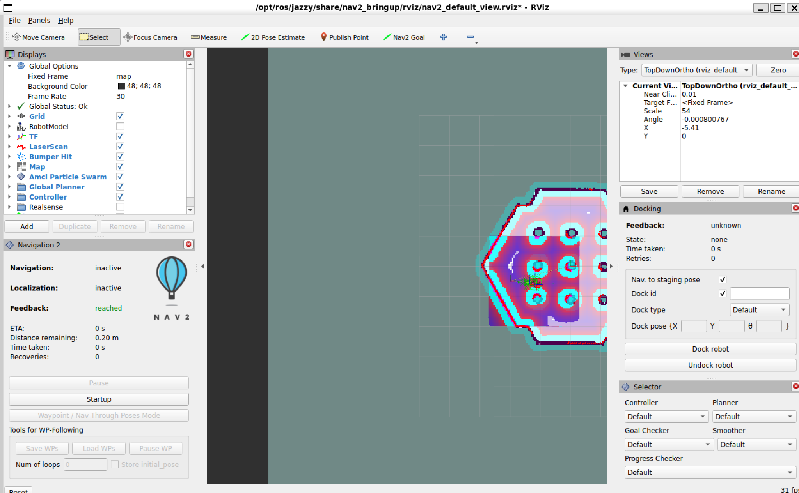

# Lab 3 Answers

## ROS topic characterization

| Topic | Message type | Approx. rate | Physical quantity | Likely consumer |
|---|---|---:|---|---|
| `/scan` | `sensor_msgs/msg/LaserScan` | 4.84 Hz | Distance from LiDAR | AMCL, obstacle detection |
| `/odom` | `nav_msgs/msg/Odometry` | 26.57 Hz | Position and velocity | Localization, control |
| `/imu` | `sensor_msgs/msg/Imu` | 191.7 Hz | Acceleration and rotation | State estimation |
| `/joint_states` | `sensor_msgs/msg/JointState` | 321.9 Hz | Wheel position and speed | Robot state publisher |

The IMU and joint states updated much faster than
the LiDAR scan.

## Publisher and subscriber relationship

Nav2 publishes movement commands on `/cmd_vel`.

The robot controller subscribes to `/cmd_vel`
and uses those commands to move the robot.

## Coordinate frames

The main robot frame was `base_link`.

Two sensor frames I found were:

- `imu_link`
- `base_scan`

The TF data showed:

`base_link -> imu_link`

`base_link -> base_scan`

The full localization chain was:

`map -> odom -> base_footprint -> base_link`

Sensor frames matter because the robot needs to know
where each sensor is located so the data lines up
correctly.

## Topic inventory helper

I ran:

`python3 src/topic_inventory.py`

It showed the active topics and their message types.

Some examples were:

- `/scan`
- `/odom`
- `/imu`
- `/joint_states`
- `/tf`
- `/tf_static`

## Sensor-to-function mapping

| Sensor | What it measures | Limitation | Used for | Complements |
|---|---|---|---|---|
| Camera | Images | Bad lighting | Object detection | LiDAR |
| LiDAR | Distance | Limited object detail | Mapping and obstacle detection | Camera |
| IMU | Acceleration and rotation | Drift | Motion estimation | Wheel odometry |
| Wheel odometry | Wheel movement | Wheel slip | Local position estimate | IMU |

## Autonomous navigation observation

The robot successfully completed the navigation goal.

The terminal showed:

`Goal finished with status: SUCCEEDED`

After moving, `/odom` showed about:

`x = 0.818`

`y = -0.061`

## Engineering Questions

### 1. Why is a high-rate sensor not automatically a high-quality sensor?

A sensor can update very fast and still have noise,
bad calibration, or inaccurate data.

### 2. Why must timestamps and frames be correct before sensor fusion?

The system needs to know when the data was recorded
and where the sensor is located.

If either one is wrong, the sensor data may not line
up correctly.

### 3. Which sensors would you trust for short-term motion? Which for long-term global position?

For short-term motion, I would trust the IMU and
wheel odometry.

For long-term position, I would trust LiDAR
localization, maps, or GPS more because odometry
can drift over time.

### 4. What happens if LiDAR data is delayed by 500 ms?

The robot could react to old obstacle information.

This could affect localization, costmaps, planning,
and obstacle avoidance.

### 5. Block

```text
Sensors
  |
  v
ROS 2 Topics
  |
  v
Localization
  |
  v
Planner
  |
  v
Controller
  |
  v
/cmd_vel
  |
  v
Robot Wheels
```

## RViz2 Screenshot


